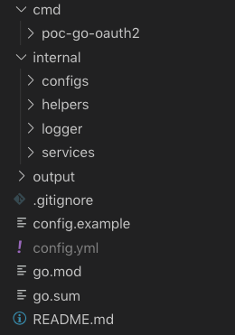
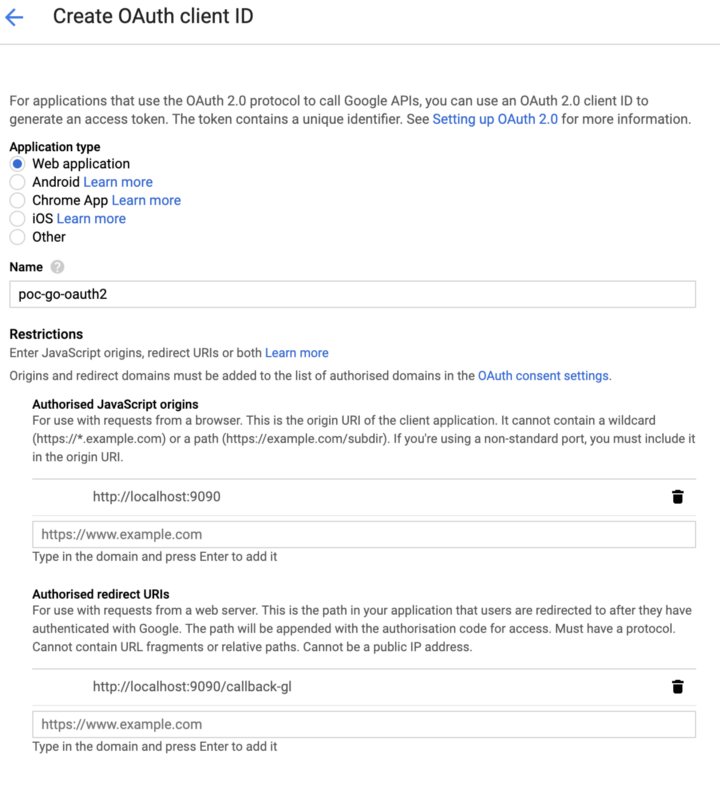
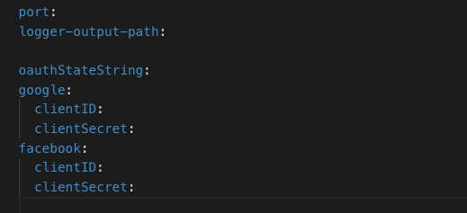
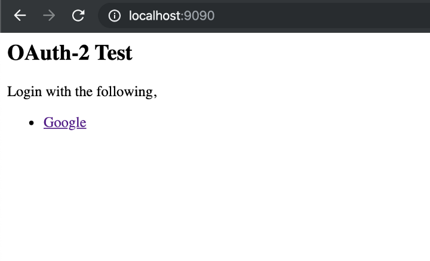

# OAuth2 при помощи google аккаунта на go

## Введение в OAuth2 в GO
Аутентификация является одной из самых важных задач, когда дело доходит до разработки. Это точка входа, где мы 
завоевываем доверие пользователя, а также это первая точка взаимодействия пользователя с любым приложением. 
И, следовательно, очень важно, чтобы процесс аутентификации был очень простым, прямым, а также очень безопасным.

Вот тут-то и вступает в игру OAuth2, который облегчает жизнь как пользователю, так и разработчику. 
Это помогает пользователю, позволяя ему зарегистрироваться и войти в систему с помощью нескольких щелчков мыши, 
и это помогает разработчику, устраняя создание и проверку регистрационных форм, а также основную часть процесса 
аутентификации, просто предоставляя пользователю возможность получить разрешение для любого приложения на доступ
к деталям из другого приложения.

## Что такое OAuth2??
OAuth2 - это, по сути, платформа авторизации, которая предоставляет другим приложениям возможность получать 
ограниченный доступ или информацию с разрешения пользователя через учетные записи пользователей из http-сервиса, 
такого как google, facebook, github и т.д. которые мы будем называть в наших статьях социальными сетями или социальными 
аккаунтами.

Цель использования oauth состоит в том, чтобы уменьшить объем работы, которую необходимо выполнить пользователю и 
приложению (работу разработчиков конечноже),

Но КАК?? → благодаря тому, что пользователю не нужно заполнять длинные формы для ввода данных (разработчику не нужно 
разрабатывать эти длинные формы). А также для идентификации пользователя ему не нужно вводить адрес электронной почты 
или имя пользователя и пароль, просто можно нажать на опцию социальной учетной записи, чтобы войти в систему и 
предоставить идентификатор пользователя → Гораздо меньше работы для всех.

## Чего мы действительно хотим достичь с помощью oauth2??
Мы хотим, чтобы аутентификация выполнялась с помощью среды oauth2, и если это будет выполнено успешно, мы предоставим 
пользователю доступ (авторизацию) для использования системы.

Оооокккк... Но... как это делается на самом деле?? Давайте разберем этот процесс на простые шаги:
* Во-первых, мы хотим, чтобы пользователь выполнил действие (например, нажал кнопку), чтобы запросить доступ к системе 
(регистрация или вход в систему). Здесь мы перенаправим запрос на соответствующий провайдер (google, facebook или 
любой другой) → Поэтому нам понадобится конечная точка в серверной части, чтобы выполнить эту функцию перенаправления 
пользователя на другую страницу (где пользователь будет аутентифицирован через среду oauth2).
* Затем мы хотим, чтобы предоставленный провайдер отправил нам ответ, и нам нужно обработать пользователя в 
соответствии с ответом (независимо от того, предоставлять ли доступ к системе или нет) → Таким образом, нам понадобится 
другая конечная точка для обработки обратного вызова предыдущего запроса с перенаправленной страницы.

** Если вы новичок в oauth, у вас может возникнуть несколько вопросов о логике вышеуказанных шагов, пожалуйста, 
укажите любые вопросы в комментариях. Я постараюсь дать ответ как можно скорее.

## Давай погрузимся...
Давайте сначала создадим структуру каталогов и все необходимые файлы и настроим скелет для нашего проекта. 
Всегда хорошо применять лучшие практики, прежде чем погружаться глубоко. Итак, давайте седеним нашу структуру каталогов 
с go модулями viper и logger.

Давайте создадим следующую структуру каталогов:



Прежде чем мы погрузимся в реальное кодирование, мы проделаем небольшую фоновую работу. Мы должны создать проект в
Google Developer Console и получить наши учетные данные OAuth2 для проекта.

Перейдите в [Google Developer Console](https://console.developers.google.com/) и создайте проект или используйте один 
из существующих проектов. Здесь вам нужно получить учетные данные OAuth2 (ClientID и ClientSecret) от Google. 
Шаги, которые необходимо выполнить, чтобы получить учетные данные, перечислены ниже.

- Выберете "Credentials" на левой панеле меню.
- Нажмите на "Create Credentials" и выберете "OAuth Client ID".
- Затем выберите тип приложения, здесь мы разрабатываем веб-приложение, поэтому выберите "web application".
- Укажите имя для вашего OAuth 2.0 клиента.
- Затем необходимо указать "Authorized Javascript origins" (Проще говоря, имена хостов которые будут спользоваться 
для входа через браузер) и "Authorized redirect URIs" (конечные точки нашего бэкенда, на которые Google будет 
перенаправлять ответы)

  → Для “Authorized Javascript origins”, я укажу "http://localhost:9090", так как я буду работать на локальном хосте.

  → Для “Authorized redirect URIs”, я укажу "http://localhost:9090/callback-gl"

- Теперь ваша форма должна выглядеть примерно так как изображении ниже.



- Затем нажмите «Create». Он предоставит вам client id и client secret. Скопируйте их в файл, чтобы мы могли 
использовать их в нашем приложении.


Получив учетные данные, скопируйте и вставьте client_id и client_secret в файл config.yml, как показано ниже, 
или добавьте их в системные переменные среды,



Давайте напишем код для чтения файлов конфигурации и переменных среды, создадим файл с именем inits.go 
(или с любым подходящим именем) в каталоге config и добавим следующий код:

```go
package configs

import (
	"fmt"

	"github.com/spf13/viper"
)

/*
InitializeViper Function initializes viper to read config.yml file and environment variables in the application.
*/
func InitializeViper() {
	// Set the file name of the configurations file
	viper.SetConfigName("config")

	// Set the path to look for the configurations file
	viper.AddConfigPath(".")

	// Enable VIPER to read Environment Variables
	viper.AutomaticEnv()

	viper.SetConfigType("yml")
	if err := viper.ReadInConfig(); err != nil {
		fmt.Printf("Error reading config file, %s", err)
	}
}
```

Теперь давайте напишем код для создания и инициализации логгера (я использовал логгер uber/zap для этого 
проекта), создадим файл с именем logger.go в каталоге logger и добавим следующий код:

```go
package logger

import (
	"github.com/spf13/viper"
	"go.uber.org/zap"
	"go.uber.org/zap/zapcore"
)

var (
	// Log variable is a globally accessible variable which will be initialized when the InitializeZapCustomLogger function is executed successfully.
	Log *zap.Logger
)

/*
InitializeZapCustomLogger Funtion initializes a logger using uber-go/zap package in the application.
*/
func InitializeZapCustomLogger() {
	conf := zap.Config{
		Encoding:    "json",
		Level:       zap.NewAtomicLevelAt(zapcore.InfoLevel),
		OutputPaths: []string{viper.GetString("logger-output-path"), "stdout"},
		EncoderConfig: zapcore.EncoderConfig{
			LevelKey:     "level",
			TimeKey:      "time",
			CallerKey:    "file",
			MessageKey:   "msg",
			EncodeLevel:  zapcore.LowercaseLevelEncoder,
			EncodeTime:   zapcore.ISO8601TimeEncoder,
			EncodeCaller: zapcore.ShortCallerEncoder,
		},
	}
	Log, _ = conf.Build()
}
```

Выполнив всю необходимую фоновую работу, давайте посмотрим н нашу систему и как работает oauth2.

## Давайте реализуем конечные точки (функции)
Давайте создадим функцию для инициализации oauth2 для Google в нашей системе, создадим файл с именем google.go в 
каталоге internal/services и добавим следующий код:

```go
var (
	oauthConfGl = &oauth2.Config{
		ClientID:     "",
		ClientSecret: "",
		RedirectURL:  "http://localhost:9090/callback-gl",
		Scopes:       []string{"https://www.googleapis.com/auth/userinfo.email"},
		Endpoint:     google.Endpoint,
	}
	oauthStateStringGl = ""
)

/*
InitializeOAuthGoogle Function
*/
func InitializeOAuthGoogle() {
	oauthConfGl.ClientID = viper.GetString("google.clientID")
	oauthConfGl.ClientSecret = viper.GetString("google.clientSecret")
	oauthStateStringGl = viper.GetString("oauthStateString")
}
```

В приведенном выше сегменте кода мы создаем необходимые константы конфигурации, которые необходимо отправить, когда 
нам нужно вызвать Google для авторизации, туда мы отправляем,

- ClientID — взято из конфигурационного файла
- ClientSecret — взято из конфигурационного файла
- RedirectURL — конечная точка, на которую Google должен отправить обратный вызов.
- Scopes array — Список пользовательских данных, которые мы требуем от Google.
- Endpoint — конечные точки, предоставляемые Google для oauth2.

В функции InitializeOAuthGoogle мы устанавливаем значения для переменных, которые должны быть исключены из кода, 
поскольку нам нужно держать их в секрете и/или нам нужно будет изменить их значения, и это не должно влиять на код.

Теперь создайте файл с именем common.go в каталоге internal/services, где мы создадим функцию входа в систему, которая 
отвечает на запрос пользователя на вход и перенаправляет пользователя с вышеуказанными конфигурациями для выполнения 
аутентификации на стороне Google. Добавьте следующий код в файл common.go:

```go
/*
HandleLogin Function
*/
func HandleLogin(w http.ResponseWriter, r *http.Request, oauthConf *oauth2.Config, oauthStateString string) {
	URL, err := url.Parse(oauthConf.Endpoint.AuthURL)
	if err != nil {
		logger.Log.Error("Parse: " + err.Error())
	}
	logger.Log.Info(URL.String())
	parameters := url.Values{}
	parameters.Add("client_id", oauthConf.ClientID)
	parameters.Add("scope", strings.Join(oauthConf.Scopes, " "))
	parameters.Add("redirect_uri", oauthConf.RedirectURL)
	parameters.Add("response_type", "code")
	parameters.Add("state", oauthStateString)
	URL.RawQuery = parameters.Encode()
	url := URL.String()
	logger.Log.Info(url)
	http.Redirect(w, r, url, http.StatusTemporaryRedirect)
}
```


**Она хранится в файле common.go, поскольку функция перенаправления одинакова или очень похожа на всех носителях 
oauth2, и, следовательно, она вынесена в качестве общей функции.

Нам нужны еще 2 функции в файле google.go для обработки функции входа в систему и функции обратного вызова, 
которая будет вызываться Google.

Чтобы передать правильные конфигурации oauth в общую функцию входа в систему, нам нужна другая функция, которая 
сначала будет обрабатывать запрос на вход от пользователя, а затем вызывать общую функцию входа с 
правильными параметрами oauth. Мы назовем ее функцией HandleGoogleLogin.

Давайте создадим функцию для обработки обратного вызова от Google, назовем ее функцией CallbackFromGoogle, 
которая будет вызываться Google, когда он хочет отправить ответ на наш сервер.

Теперь готовый файл google.go должен выглядеть следующим образом:

```go
package services

import (
	"io/ioutil"
	"net/http"
	"net/url"

	"github.com/BNPrashanth/poc-go-oauth2/internal/logger"

	"github.com/spf13/viper"
	"golang.org/x/oauth2"
	"golang.org/x/oauth2/google"
)

var (
	oauthConfGl = &oauth2.Config{
		ClientID:     "",
		ClientSecret: "",
		RedirectURL:  "http://localhost:9090/callback-gl",
		Scopes:       []string{"https://www.googleapis.com/auth/userinfo.email"},
		Endpoint:     google.Endpoint,
	}
	oauthStateStringGl = ""
)

/*
InitializeOAuthGoogle Function
*/
func InitializeOAuthGoogle() {
	oauthConfGl.ClientID = viper.GetString("google.clientID")
	oauthConfGl.ClientSecret = viper.GetString("google.clientSecret")
	oauthStateStringGl = viper.GetString("oauthStateString")
}

/*
HandleGoogleLogin Function
*/
func HandleGoogleLogin(w http.ResponseWriter, r *http.Request) {
	HandleLogin(w, r, oauthConfGl, oauthStateStringGl)
}

/*
CallBackFromGoogle Function
*/
func CallBackFromGoogle(w http.ResponseWriter, r *http.Request) {
	logger.Log.Info("Callback-gl..")

	state := r.FormValue("state")
	logger.Log.Info(state)
	if state != oauthStateStringGl {
		logger.Log.Info("invalid oauth state, expected " + oauthStateStringGl + ", got " + state + "\n")
		http.Redirect(w, r, "/", http.StatusTemporaryRedirect)
		return
	}

	code := r.FormValue("code")
	logger.Log.Info(code)

	if code == "" {
		logger.Log.Warn("Code not found..")
		w.Write([]byte("Code Not Found to provide AccessToken..\n"))
		reason := r.FormValue("error_reason")
		if reason == "user_denied" {
			w.Write([]byte("User has denied Permission.."))
		}
		// User has denied access..
		// http.Redirect(w, r, "/", http.StatusTemporaryRedirect)
	} else {
		token, err := oauthConfGl.Exchange(oauth2.NoContext, code)
		if err != nil {
			logger.Log.Error("oauthConfGl.Exchange() failed with " + err.Error() + "\n")
			return
		}
		logger.Log.Info("TOKEN>> AccessToken>> " + token.AccessToken)
		logger.Log.Info("TOKEN>> Expiration Time>> " + token.Expiry.String())
		logger.Log.Info("TOKEN>> RefreshToken>> " + token.RefreshToken)

		resp, err := http.Get("https://www.googleapis.com/oauth2/v2/userinfo?access_token=" + url.QueryEscape(token.AccessToken))
		if err != nil {
			logger.Log.Error("Get: " + err.Error() + "\n")
			http.Redirect(w, r, "/", http.StatusTemporaryRedirect)
			return
		}
		defer resp.Body.Close()

		response, err := ioutil.ReadAll(resp.Body)
		if err != nil {
			logger.Log.Error("ReadAll: " + err.Error() + "\n")
			http.Redirect(w, r, "/", http.StatusTemporaryRedirect)
			return
		}

		logger.Log.Info("parseResponseBody: " + string(response) + "\n")

		w.Write([]byte("Hello, I'm protected\n"))
		w.Write([]byte(string(response)))
		return
	}
}
```

Чтобы что-то отобразить пользователю и заставить пользователя вызвать какую-то функцию из браузера, 
давайте создадим простую веб-страницу. Создайте файл и назовите его html.go в каталоге internal/helpers/pages и 
добавьте в него следующий код:

```go
package pages

/*
IndexPage renders the html content for the index page.
*/
const IndexPage = `
<html>
	<head>
		<title>OAuth-2 Test</title>
	</head>
	<body>
		<h2>OAuth-2 Test</h2>
		<p>
			Login with the following,
		</p>
		<ul>
			<li><a href="/login-gl">Google</a></li>
		</ul>
	</body>
</html>
`
```

После этого в файл common.go добавьте следующий код для отображения вышеуказанной html-страницы:

```go
/*
HandleMain Function renders the index page when the application index route is called
*/
func HandleMain(w http.ResponseWriter, r *http.Request) {
	w.Header().Set("Content-Type", "text/html; charset=utf-8")
	w.WriteHeader(http.StatusOK)
	w.Write([]byte(pages.IndexPage))
}
```

Функция HandleMain предоставит индексную страницу и загрузит ее в браузере при вызове соответствующей конечной точки.

Теперь готовый файл common.go должен выглядеть следующим образом:

```go
package services

import (
	"net/http"
	"net/url"
	"strings"

	"github.com/BNPrashanth/poc-go-oauth2/internal/helpers/pages"
	"github.com/BNPrashanth/poc-go-oauth2/internal/logger"
	"golang.org/x/oauth2"
)

/*
HandleMain Function renders the index page when the application index route is called
*/
func HandleMain(w http.ResponseWriter, r *http.Request) {
	w.Header().Set("Content-Type", "text/html; charset=utf-8")
	w.WriteHeader(http.StatusOK)
	w.Write([]byte(pages.IndexPage))
}

/*
HandleLogin Function
*/
func HandleLogin(w http.ResponseWriter, r *http.Request, oauthConf *oauth2.Config, oauthStateString string) {
	URL, err := url.Parse(oauthConf.Endpoint.AuthURL)
	if err != nil {
		logger.Log.Error("Parse: " + err.Error())
	}
	logger.Log.Info(URL.String())
	parameters := url.Values{}
	parameters.Add("client_id", oauthConf.ClientID)
	parameters.Add("scope", strings.Join(oauthConf.Scopes, " "))
	parameters.Add("redirect_uri", oauthConf.RedirectURL)
	parameters.Add("response_type", "code")
	parameters.Add("state", oauthStateString)
	URL.RawQuery = parameters.Encode()
	url := URL.String()
	logger.Log.Info(url)
	http.Redirect(w, r, url, http.StatusTemporaryRedirect)
}
```

Для создания необходимых конечных точек я буду использовать пакет «net/http» (https://golang.org/pkg/net/http/). 
Давайте создадим файл main.go и добавим следующий код:

```go
package main

import (
	"log"
	"net/http"

	"github.com/gs-open-provider/poc-go-oauth2/internal/configs"
	"github.com/gs-open-provider/poc-go-oauth2/internal/logger"
	"github.com/gs-open-provider/poc-go-oauth2/internal/services"

	"github.com/spf13/viper"
)

func main() {
	// Initialize Viper across the application
	configs.InitializeViper()

	// Initialize Logger across the application
	logger.InitializeZapCustomLogger()

	// Initialize Oauth2 Services
	services.InitializeOAuthGoogle()

	// Routes for the application
	http.HandleFunc("/", services.HandleMain)
	http.HandleFunc("/login-gl", services.HandleGoogleLogin)
	http.HandleFunc("/callback-gl", services.CallBackFromGoogle)

	logger.Log.Info("Started running on http://localhost:" + viper.GetString("port"))
	log.Fatal(http.ListenAndServe(":"+viper.GetString("port"), nil))
}
```
Теперь мы собрали весь необходимый код, и мы можем приступить к запуску приложения. Введите 
go run cmd/poc-go-oauth2/main.go, чтобы запустить его.

Затем перейдите в браузер и введите http://localhost:9090 (если вы указали другой порт, укажите его вместо 9090) 
и нажмите Enter, вы увидите очень простую html-страницу, как показано ниже:



Теперь наше приложение завершено и запущено, вы можете поиграть и посмотреть, как мы моглибы использовать oauth для 
выполнения аутентификации в любом другом приложения, а также можете посмотреть на данные, которые Google отправляет 
во время аутентификации. Можете проверить, как работает oauth и чего мы действительно можем получить от него. 
Как всегда, опыт — лучший учитель и лучший способ учиться.

как раз об этом в этой статье. Я надеюсь, что я хорошо поработал, и это было полезно, и вы узнали что-то новое из 
этого, и вам понравилось то, что вы только что прочитали. Пожалуйста, оставляете ваши комментарии, предложения и идеи.

[Оригинал статьи](https://medium.com/@bnprashanth256/introduction-to-oauth2-in-go-golang-da258a8ecaf8)